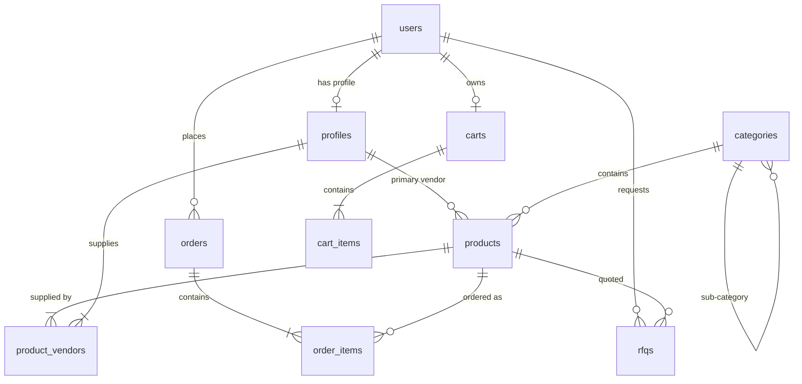

# Database Schema Documentation

This document outlines the PostgreSQL database structure for Gascart, hosted on Supabase. It details the core tables, their relationships, and the security model.

---

## 1. Overview
The database uses **PostgreSQL** with several extensions enabled (e.g., `uuid-ossp` for primary keys). All tables are in the `public` schema and integrate with **Supabase Auth** (`auth.users`) through foreign key references.

---

## 2. Core Tables

### profiles
Extends the base Supabase `auth.users` table with application-specific metadata.
- **id**: UUID (Primary Key, references `auth.users.id`)
- **email**: TEXT (Unique)
- **full_name**: TEXT
- **role**: TEXT (`customer`, `admin`, `vendor`)
- **company_name**: TEXT (For vendors)
- **visibility_status**: TEXT (`active`, `inactive`, `hidden`)
- **vendor_documents**: JSONB (URLs for certifications, agreements, etc.)
- **created_at / updated_at**: TIMESTAMPTZ

### categories
Hierarchical structure for organizing products and articles.
- **id**: UUID (Primary Key)
- **name / slug**: TEXT (Slug is unique)
- **parent_id**: UUID (Self-reference for subcategories)
- **image_url**: TEXT
- **status**: TEXT (`active`, `deleted` - for soft delete support)

### products
Central repository for all items in the marketplace.
- **id**: UUID (Primary Key)
- **name / slug**: TEXT (Slug is unique)
- **description**: TEXT
- **price**: DECIMAL (Current selling price)
- **compare_at_price**: DECIMAL (Original price for discounts)
- **stock_quantity**: INTEGER
- **category_id**: UUID (References `categories.id`)
- **purchase_model**: TEXT (`direct` for checkout, `rfq` for custom quotes)
- **images**: TEXT[] (Array of URLs)
- **attributes**: JSONB (Dynamic specs like capacity, pressure, etc.)
- **visibility_status**: TEXT (`published`, `draft`, `hidden`)
- **advance_percentage**: DECIMAL (For partial payment models)

### product_vendors
Many-to-many bridge table connecting products to available suppliers.
- **product_id**: UUID (References `products.id`)
- **vendor_id**: UUID (References `profiles.id`)
- **is_primary**: BOOLEAN
- **lead_time**: TEXT

### orders & order_items
Tracks finalized sales and their line items.
- **orders**:
    - **user_id**: UUID (References `auth.users.id`)
    - **total_amount**: DECIMAL
    - **status**: TEXT (`pending`, `processing`, `shipped`, `delivered`, `cancelled`)
    - **payment_status**: TEXT (`unpaid`, `paid`, `refunded`, `failed`)
    - **shipping_address / billing_address**: JSONB (Snapshots of address at purchase)
    - **razorpay_order_id**: TEXT
- **order_items**:
    - **order_id**: UUID (References `orders.id`)
    - **product_id**: UUID (References `products.id`)
    - **quantity**: INTEGER
    - **price_at_purchase**: DECIMAL

### carts & cart_items
Persists shopping states for both logged-in users and guests.
- **carts**:
    - **user_id**: UUID (References `auth.users.id`, optional)
    - **session_id**: TEXT (For guest tracking)
- **cart_items**:
    - **cart_id**: UUID (References `carts.id`)
    - **product_id**: UUID (References `products.id`)
    - **quantity**: INTEGER

### rfqs (Requests for Quote)
Manages the custom quotation lifecycle for industrial equipment.
- **user_id**: UUID (References `auth.users.id`)
- **product_id**: UUID (References `products.id`)
- **vendor_id**: UUID (References `profiles.id`, optional)
- **status**: TEXT (`new`, `processing`, `completed`, `rejected`, `closed`)
- **submitted_fields**: JSONB (User answers to product-specific RFQ questions)

### consultants & consultant_inquiries
Expert network for consulting services in the Oil & Gas sector.
- **consultants**:
    - **profile_id**: UUID (References `profiles.id`)
    - **specialties**: TEXT[]
    - **experience_years**: INTEGER
    - **bio**: TEXT
- **consultant_inquiries**:
    - **user_id**: UUID (References `auth.users.id`)
    - **consultant_id**: UUID (References `consultants.id`)
    - **status**: TEXT (`new`, `contacted`, `resolved`)

### audit_logs
Tracks administrative changes and sensitive operations.
- **user_id**: UUID (Who performed the action)
- **action**: TEXT (e.g., `UPDATE_PRODUCT_STOCK`, `APPROVE_VENDOR`)
- **entity_type**: TEXT (`product`, `vendor`, `order`)
- **entity_id**: UUID
- **old_data / new_data**: JSONB

---

## 3. Relationships Diagram (Simplified)

---

## 4. Security Model
The database implements **Row Level Security (RLS)** across all critical tables:
- **Public Access**: Tables like `products` and `categories` are viewable by anyone.
- **User Privacy**: Users can only view their own `orders`, `rfqs`, and `profiles`.
- **Admin Control**: Users with the `admin` role in their profile have `ALL` permissions on all tables.
- **Vendor Access**: Vendors are restricted to viewing their assigned products and enquiries.
